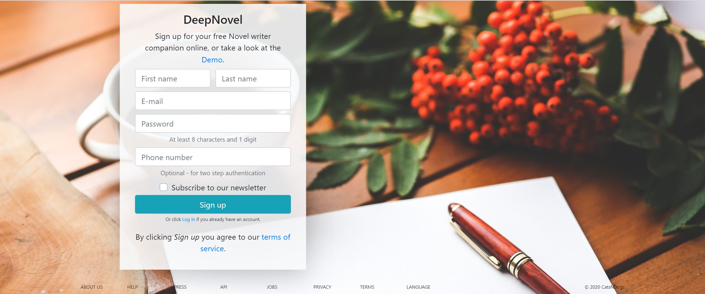
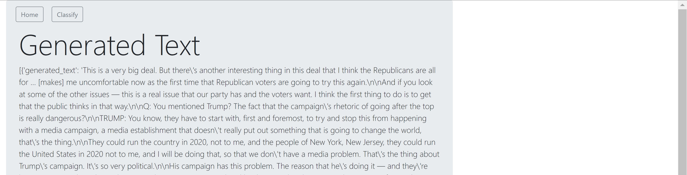

    

## Basic Overview

This project is concerned with building an artificial intelligence **application**, that can **write novels and illustrate** them. In the accompanying [Document](https://hackmd.io/@TB-DevAcc/ryPc0v7sI) we will outline the different models and techniques used to achieve a result, that should be as little distinguishable from human writing as possible. Therefore we will provide examples of generated text from short text input, as well as images, that were generated from text samples from the generated text. We will also discuss the limitations and future improvements that can be made. 

#### :date: Timeframe for the project
Completion of the webapp and model was meant to be achieved within 3 weeks. (25.05.20-12.06.20)

#### :clapper: Usage

To view the complete WebApp run main.py to start the development server. Here is a short preview of the site:

    

<!--   

    

 -->

### :boy: Author

**Tobias Becher**
- GitHub [TB-DevAcc](https://github.com/TB-DevAcc/)
- LinkedIn [Tobias Becher](https://www.linkedin.com/in/tobias-becher-b34341197)

### :pray: Acknowledgments

[CoderSchool](https://www.coderschool.vn/en/) for their help, support & mentorship  

HuggingFace, OpenAi and others for their work and research. A full list of used papers can be found [here](https://hackmd.io/@TB-DevAcc/ryPc0v7sI#Related-Work-amp-Helpful-Links).

Page-Icon made by <a href="https://www.flaticon.com/free-icon/book_2506510" title="srip">srip</a> from <a href="https://www.flaticon.com/" title="Flaticon"> www.flaticon.com</a>
Main-site Background by [Kaboompics .com](https://www.pexels.com/@kaboompics?utm_content=attributionCopyText&utm_medium=referral&utm_source=pexels) from [Pexels](https://www.pexels.com/photo/blank-paper-with-pen-and-coffee-cup-on-wood-table-6357/?utm_content=attributionCopyText&utm_medium=referral&utm_source=pexels)

### 📝 License

Copyright © 2020 [Tobias Becher](https://github.com/TB-DevAcc).  
This project is [MIT](https://github.com/kefranabg/readme-md-generator/blob/master/LICENSE) licensed.
